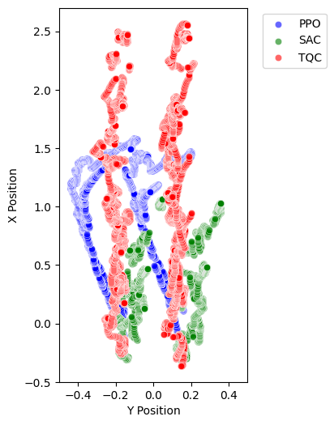

# TELOS RL - Quadruped Robot Locomotion Control

This project focuses on developing a locomotion controller for a quadruped robot using Reinforcement Learning (RL).

## Project Overview

Legged robots, especially quadrupeds, are a complex and advancing area in robotics. While hardware has seen significant improvements, creating robust control systems for smooth and stable movement remains a key challenge.

Inspired by advancements like ETH Zurich’s ANYmal and Boston Dynamic’s Spot, this project undertakes the development of a locomotion controller. The primary goal is to explore the capabilities of Reinforcement Learning in enabling a quadruped robot to achieve a basic forward walking gait.

This work concentrates on the control aspect, aiming to demonstrate RL's effectiveness in solving intricate locomotion tasks for quadruped robots.

## Approaches and Learning Journey

This project represents a significant undertaking in the practical application and exploration of Reinforcement Learning for robotic control. The core of this endeavor was to train a quadruped robot for a basic forward walking gait using various state-of-the-art RL algorithms.

### Algorithms Explored:
The primary algorithms investigated include:
*   **Proximal Policy Optimization (PPO):** A robust on-policy algorithm known for its stability and performance across a wide range of tasks.
*   **Soft Actor-Critic (SAC):** A powerful off-policy algorithm designed for continuous action spaces, known for its sample efficiency and entropy maximization encouraging exploration.
*   **Truncated Quantile Critics (TQC):** An advanced off-policy algorithm that builds upon SAC by using quantile regression to estimate the value distribution, often leading to improved performance and stability.

### Development Environment & Tools:
The development heavily relied on a suite of powerful tools and libraries:
*   **PyBullet:** Utilized for creating a custom, realistic simulation environment for the quadruped robot, allowing for rapid prototyping and training without the need for physical hardware.
*   **Gymnasium:** Provided the standardized interface for developing the custom reinforcement learning environments, ensuring compatibility with RL libraries.
*   **Stable Baselines3 (SB3):** Served as the backbone for implementing and experimenting with the PPO, SAC, and TQC algorithms. Its well-structured and optimized implementations were crucial for training the agents.

The process involved a deep dive into designing custom RL environments, including defining observation and action spaces, crafting reward functions conducive to learning a stable walking gait, and implementing curriculum learning strategies (as seen in `CurriculumCallback` within the training scripts) to gradually increase task difficulty.

### Project Scripts:
The repository contains several key Python scripts:
*   `ppo_walking.py`, `sac_walking.py`, `tqc_walking.py`: These scripts are dedicated to training the quadruped robot using the PPO, SAC, and TQC algorithms, respectively. They configure the environment, agent, and training parameters.
*   `sac_standing.py`, `sac_refinement.py`, `ppo_walking_refinement.py`: These scripts suggest an iterative approach, possibly starting with simpler tasks like standing and then refining gaits or reloading pre-trained models for further training.
*   `src/`: This directory likely houses the core components of the custom environment, including:
    *   `agent.py` (`TelosAgent`): Defines the robot agent within the simulation.
    *   `walking_task/walking_task.py` (`WalkingTelosTask`) and `walking_task/walking_environment.py` (`WalkingTelosTaskEnv`): Define the specifics of the walking task, reward structure, and environment logic.
    *   Similar structures exist for a `standing_task`.
*   `telos_test.ipynb`: A Jupyter Notebook used for testing, debugging, visualization, and ad-hoc experimentation with the environment and trained agents.

## Outcomes

The training process yielded agents capable of demonstrating a forward walking gait. The `combined_gaits.png` image visualizes the X-Y trajectory of the robot's base when controlled by agents trained with PPO, SAC, and TQC.

    

*   **PPO (Blue):** Shows a particular trajectory, indicating the learned locomotion pattern.
*   **SAC (Green):** Displays a different path, potentially highlighting variations in stability or step strategy compared to PPO.
*   **TQC (Red):** Illustrates its learned gait, which appears to cover more ground in the X-direction and exhibits a wider side-to-side (Y) motion compared to the others in this particular visualization.
